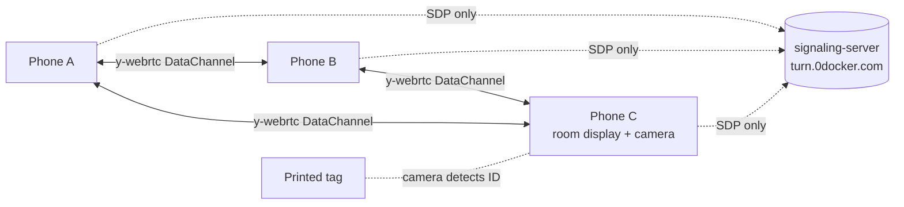

# mesh-standup

[](https://baditaflorin.github.io/mesh-standup/)
[](https://github.com/baditaflorin/mesh-standup/blob/main/package.json)
[](LICENSE)
[](docs/adr/0001-deployment-mode.md)

> Peer-to-peer mesh: round-robin standup timer with ArUco baton-pass. Hold up your printed tag card to claim the floor.

**Live:** https://baditaflorin.github.io/mesh-standup/

Open the link on every phone in your standup. Tap **Connect to standup**.
The roster builds itself from whoever joins; one speaker at a time has the
floor for 60 seconds (configurable). When the timer hits zero, every phone
vibrates and the baton passes to the next person. No accounts, no installs,
no server you have to trust.

For hands-free standups, switch to **ArUco mode**: one phone becomes the
room display + camera scanner. Each person carries a printed tag card; hold
it up to the camera to claim the floor.

## Try it in 2 tabs

Open the [live app](https://baditaflorin.github.io/mesh-standup/) in two
browser tabs (same link = same room). Set a name in each via the ⚙ settings
drawer, tap **Connect to standup** in both, then **Start round** in one — both
tabs show the same speaker and the same countdown. Tap **Skip / next** or
**+30s** in one tab and watch the other update instantly. No server, no login,
no install.

## How it works

1. Each phone joins a shared **Yjs document** over **y-webrtc** via my
   [self-hosted signaling server](https://github.com/baditaflorin/signaling-server).
2. Roster, session state, current speaker, and slot duration live in the Yjs
   document. Every phone sees the same values.
3. Slot timing uses **mesh-time** — the median-offset clock sync from
   `mesh-firefly-walk`. Phones agree to ~10–30 ms, so the countdown is
   identical across the room.
4. The baton-pass is leaderless: any phone can advance, ArUco scan, or skip,
   and Yjs CRDT reconciles concurrent writes.
5. In ArUco mode, one phone opens its rear camera, runs `js-aruco2` against
   each frame, and looks up the detected ID in the roster.

## Privacy threat model

See [docs/privacy.md](docs/privacy.md). Short version: peers in the same room
see each other's names and tag IDs. The signaling and TURN servers see
encrypted WebRTC and nothing else. Camera frames stay on-device.

## Print the tag sheet

Once during scaffold, the repo runs `npm run make-markers` to generate:

- `public/markers/marker-{0..19}.png` — 256×256 PNGs, one per ID.
- `public/marker-sheet.pdf` — printable A4 sheet with IDs 0–15 in a 4×4 grid.

Open the **Settings** drawer in the live app and tap **Download printable
marker sheet (PDF)**. Print at 100% scale, cut along the cell borders, and
hand one card to each team member. They set their tag ID in their own
Settings to match the printed number.

Reserved IDs:

- `0` — "I'm done / next."
- `99` — "extend 30 s."

Everyone else uses `1..98`.

## Architecture

- **Mode A** — pure GitHub Pages.
- **WebRTC** — Yjs + y-webrtc with self-hosted signaling and TURN.
- **ArUco** — `js-aruco2` with the `ARUCO_MIP_36h12` dictionary (250 IDs,
  6×6 cells, robust error correction).



## Run it locally

```bash
git clone https://github.com/baditaflorin/mesh-standup.git
cd mesh-standup
npm install
npm run make-markers   # regenerate marker PNGs + PDF
npm run dev
```

Open the URL printed by Vite on two devices on the same Wi-Fi (or different
networks — TURN relay will kick in).

## Build for Pages

```bash
npm run build           # writes to docs/
npm run pages-preview   # serves docs/ at http://localhost:4174
```

The `docs/` output is committed to the repo. GitHub Pages serves from
`main` branch, `/docs` folder.

## Self-hosted infrastructure

| Repo                                                                   | Endpoint                               | Role                        |
| ---------------------------------------------------------------------- | -------------------------------------- | --------------------------- |
| [signaling-server](https://github.com/baditaflorin/signaling-server)   | `wss://turn.0docker.com/ws`            | y-webrtc protocol fan-out   |
| [turn-token-server](https://github.com/baditaflorin/turn-token-server) | `https://turn.0docker.com/credentials` | HMAC TURN creds, 1-hour TTL |
| [coturn-hetzner](https://github.com/baditaflorin/coturn-hetzner)       | `turn:turn.0docker.com:3479`           | TURN relay                  |

Override them from the in-app Settings drawer.

## Settings (in-app)

- **Room ID** — phones must share one to see each other.
- **Your name** — appears in the roster.
- **Your tag ID** — 1–98, must match your printed card if using ArUco mode.
- **Slot duration** — default 60 seconds.
- **Mode** — `tap` (buttons advance) or `apriltag` (camera scans tags).
- **Signaling / TURN URLs** — overrides.

All persisted to `localStorage`.

## ADRs

- [0001 — Deployment mode](docs/adr/0001-deployment-mode.md)
- [0002 — Tag-to-roster binding](docs/adr/0002-tag-to-roster-binding.md)
- [0003 — Mesh-time baton vs local setTimeout](docs/adr/0003-mesh-time-baton.md)
- [0010 — GitHub Pages publishing](docs/adr/0010-pages-publishing.md)

## Local hooks (no GitHub Actions)

```bash
git config core.hooksPath .githooks
```

- **pre-commit** — `prettier --check` + `tsc --noEmit`
- **commit-msg** — Conventional Commits validator
- **pre-push** — runs `scripts/smoke.sh` (build + sanity-check `docs/`)

## License

[MIT](LICENSE) © 2026 Florin Badita
